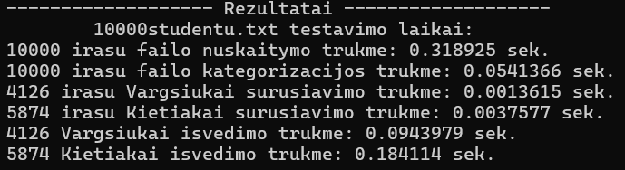

# v0.3

## Versijos aprašymas
Versija [v0.2](https://github.com/guscila/objektinis/tree/v0.2) optimizuota ir papildyta galimybe pasirinkti norimą naudoti konteinerį ( Vector arba List ) atliekant veiksmus su duomenimis. Taip pat, programa papildyta funkcija leidžiančia įvestų studentų duomenis išvesti į terminalą bei pateikianti jų saugojimo atmintyje adresus. Programa papildyta Meniu struktūra ir detalesniu pasirinkimu, o Timer'is papildytas saugojimo bei visų laiko trukmių išvedimo funkcijomis. Be to, failų spartos analizės funkcija papildyta studentų kategorizacijos bei išvedimo į failus spartos apskaičiavimu. <br>
## Programos failai:
### Programos įvesties/generavimo failų formatas:
| Vardas1 | Pavarde1 | ND1 | ND2 | ... | Egz. |
|:--------|:---------|:----|:----|:----|:-----|
| Jonas | Jonaitis | 8 | 9 | ... | 9 |
##### Komentaras:
```
Visi programa sugeneruoti failai buvo sukurti su 5 namų darbų pažymiais studentui.
```
### Programos išvedimo failų formatas:
| Vardas1 | Pavarde1 | Galutinis(Vid.) | Galutinis(Med.) |
|:--------|:---------|:----------------|:----------------|
| Jonas | Jonaitis | 7.80 | 8.00 |
### Programos rezultatų terminale formatas:
| Vardas1 | Pavarde1 | Galutinis(Vid.) | Galutinis(Med.) | Adresas |
|:--------|:---------|:----------------|:----------------|:--------|
| Jonas | Jonaitis | 7.80 | 8.00 | 0000000000A000A0 |
### Programos greičio spartos analizės rezultatų išvedimo formatas:

### Programa testuoti failai:
* Užduotyje pateikti failai:
  * "studentai10000.txt" - 10 tūkst. studentų <br>
  * "studentai100000.txt" - 100 tūkst. studentų <br>
  * "studentai1000000.txt" - 1 mln. studentų <br>
* Programos sugeneruoti failai:
  * "1000studentu.txt" - 1 tūkst. studentų <br>
  * "10000studentu.txt" - 10 tūkst. studentų <br>
  * "100000studentu.txt" - 100 tūkst. studentų <br>
  * "1000000studentu.txt" - 1 mln. studentų <br>
  * "10000000studentu.txt" - 10 mln. studentų <br>
### Testavimo sistemos parametrai:
CPU: 11th Gen Intel(R) Core(TM) i5-1135G7 @ 2.40GHz (2.42 GHz) <br>
RAM: 8.00 GB <br>
HDD: SSD 238 GB <br>
## Greičio spartos analizė:
### Testavimo laikai veiksmus atliektant su vektoriaus (vector) konteineriu:
| Failas                 | Failo sukūrimas | Duomenų nuskaitymas | Studentų kategorizacija | *'Kietiakų'<sup>1</sup>* rūšiavimas | *'Vargšiukų'<sup>2</sup>* rūšiavimas | Išvedimas į failą (*'Kietiakai'<sup>1</sup>*)  | Išvedimas į failą (*'Vargšiukai'<sup>2</sup>*) |
|:-----------------------|:----------------|:--------------------|:------------------------|:------------------------------------|:-------------------------------------|:-----------------------------------------------|:-----------------------------------------------|
| studentai10000.txt     | -               | 0,055 s             | 0,003 s                 | 0,004 s                             | 0,001 s                              | 0,023 s                                        | 0,018 s                                        |
| studentai100000.txt    | -               | 0,658 s             | 0,026 s                 | 0,014 s                             | 0,008 s                              | 0,226 s                                        | 0,155 s                                        |
| studentai1000000.txt   | -               | 3,080 s             | 0,249 s                 | 0,256 s                             | 0,179 s                              | 2,228 s                                        | 1,523 s                                        |
|                        |                 |                     |                         |                                     |                                      |                                                |                                                |
| 1000studentu.txt       | 0.011 s         | 0,0045 s            | 0,0003 s                | 0,0001 s                            | 0,0001 s                             | 0,0036 s                                       | 0,0037 s                                       |
| 10000studentu.txt      | 0.043 s         | 0,023 s             | 0,003 s                 | 0,001 s                             | 0,001 s                              | 0,022 s                                        | 0,018 s                                        |
| 100000studentu.txt     | 0.435 s         | 0,235 s             | 0,022 s                 | 0,013 s                             | 0,009 s                              | 0,216 s                                        | 0,148 s                                        |
| 1000000studentu.txt    | 4.323 s         | 2,248 s             | 0,241 s                 | 0,26 s                              | 0,179 s                              | 2,672 s                                        | 1,579 s                                        |
| 10000000studentu.txt   | 42.89 s         | 22,458 s            | 3,067 s                 | 3,213 s                             | 2,09 s                               | 25,029 s                                       | 15,467 s                                       |
<br>

### Testavimo laikai veiksmus atliektant su sąrašo (list) konteineriu:
| Failas                 | Failo sukūrimas | Duomenų nuskaitymas | Studentų kategorizacija | *'Kietiakų'<sup>1</sup>* rūšiavimas | *'Vargšiukų'<sup>2</sup>* rūšiavimas | Išvedimas į failą (*'Kietiakai'<sup>1</sup>*)  | Išvedimas į failą (*'Vargšiukai'<sup>2</sup>*) |
|:-----------------------|:----------------|:--------------------|:------------------------|:------------------------------------|:-------------------------------------|:-----------------------------------------------|:-----------------------------------------------|
| studentai10000.txt     | -               | 0,054 s             | 0,002 s                 | 0,001 s                             | 0,001 s                              | 0,025 s                                        | 0,018 s                                        |
| studentai100000.txt    | -               | 0,443 s             | 0,022 s                 | 0,013 s                             | 0,009 s                              | 0,22 s                                         | 0,159 s                                        |
| studentai1000000.txt   | -               | 3,010 s             | 0,183 s                 | 0,270 s                             | 0,189 s                              | 2,483 s                                        | 1,566 s                                        |
|                        |                 |                     |                         |                                     |                                      |                                                |                                                |
| 1000studentu.txt       | 0.011 s         | 0,0036 s            | 0,0002 s                | 0,0001 s                            | 0,0001 s                             | 0,0047 s                                       | 0,0039 s                                       |
| 10000studentu.txt      | 0.043 s         | 0,023 s             | 0,002 s                 | 0,001 s                             | 0,001 s                              | 0,024 s                                        | 0,017 s                                        |
| 100000studentu.txt     | 0.435 s         | 0,212 s             | 0,018 s                 | 0,013 s                             | 0,008 s                              | 0,223 s                                        | 0,154 s                                        |
| 1000000studentu.txt    | 4.323 s         | 2,124 s             | 0,188 s                 | 0,268 s                             | 0,186 s                              | 2,908 s                                        | 1,626 s                                        |
| 10000000studentu.txt   | 42.89 s         | 22,238 s            | 3,18 s                  | 4,37 s                              | 3,424 s                              | 22,535 s                                       | 15,912 s                                       |

##### Komentaras:
```
1 - Kietiakas - tai studentas, kurio galurinis vidurkis >=5;
2 - Vargšiukas - tai studentas, kurio galutinis vidurkis < 5;
Greičio spartos analizės lentelėse pateikti 3 testavimų laikų vidurkiai.
```
### Greičio spartos analizės išvados:
Atlikus greičio spartos analizę galime matyti, kad abiejų konteinerių greičio spartos rezultatai yra labai panašūs. Tačiau sąrašo tipo konteineris (list) sparčiau atlieka duomenų nuskaitymą iš failo bei šių duomenų kategorizaciją. Tuo tarpu vektoriaus tipo konteineris (vector) yra spartesnis duomenis išvedant į failą. <br>

